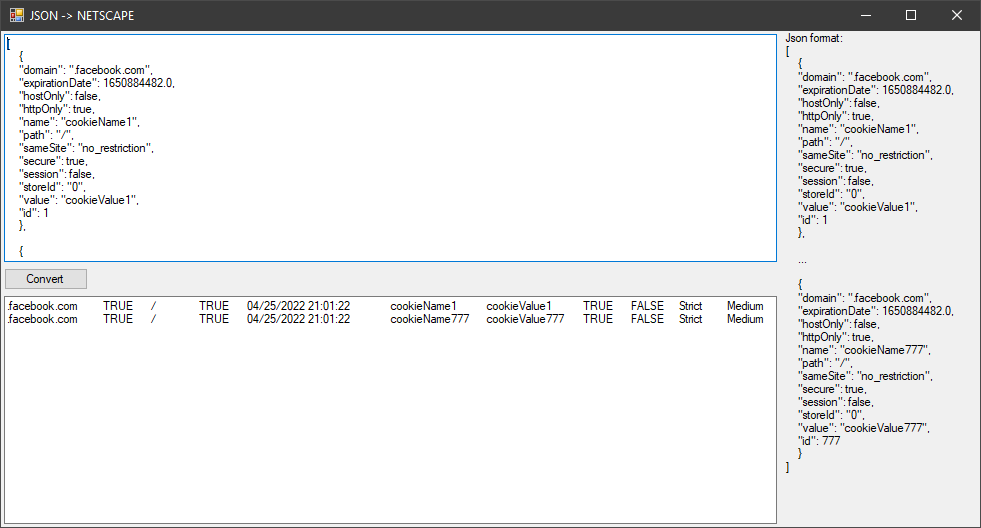

В экшене запуска программ, укажите полный путь к `JsonToNetscape`, в аргументах укажите путь к файлу.  
Когда программа будет выполнена, в ответ придёт путь к файлу с куками (файл будет в той же папке).  
Пример вывода в лог: `Json converted to netscape, result path D:\kuki\kuki_converted.txt`  

GUI версия программы:

